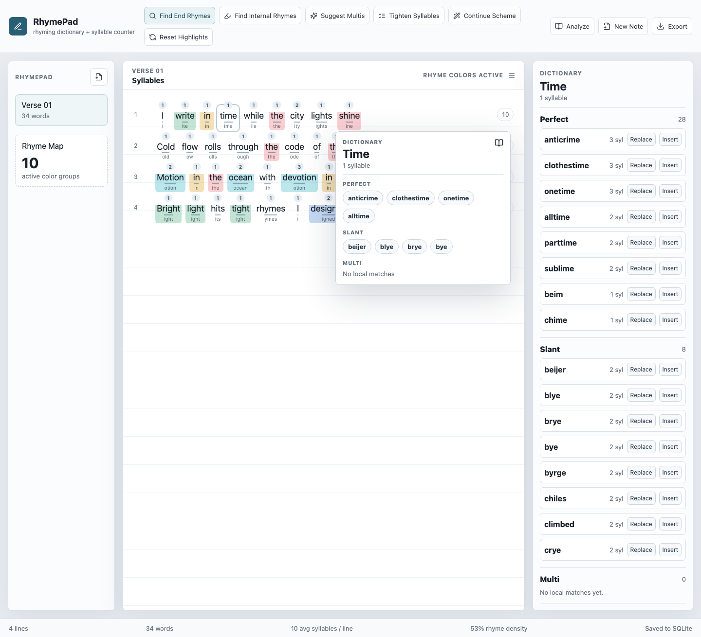
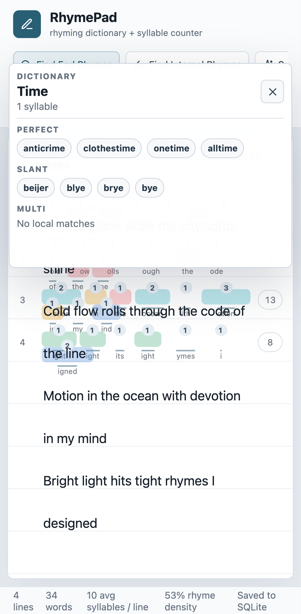

# RhymePad

**RhymePad** is a Dockerized rhyming dictionary, rhyme scheme visualizer, syllable counter, internal rhyme finder, multisyllabic rhyme tool, rap lyric editor, poetry writing app, and songwriting notepad in one simple web interface.

Write lines, inspect cadence, find rhymes, and see internal rhyme schemes highlighted with color-coded word backgrounds.



## Features

- Notepad-style lyric, rap, poem, and hook editor.
- Word syllable counts shown above each word.
- Total syllable count shown at the end of each line.
- Color-coded rhyme families for end rhymes, internal rhymes, similar endings, and multisyllabic rhyme patterns.
- Click a word to open a local rhyming dictionary.
- On mobile and Android, the clicked-word dictionary opens as a compact closable sheet so it does not trap the writing area.
- Suggestions grouped by `Perfect`, `Slant`, and `Multi`.
- `Insert` and `Replace` actions for suggestions.
- Menu bar with rhyming prompts: `Find End Rhymes`, `Find Internal Rhymes`, `Suggest Multis`, `Tighten Syllables`, `Continue Scheme`, and `Reset Highlights`.
- Local browser persistence with no login, backend, or API key required.
- SQLite persistence when running through the included Node/Express server or Docker container.
- Native Android SQLite persistence when packaged as an APK.
- Dockerized production build.
- Playwright screenshot generation for GitHub README images.

## Screenshots

Desktop:


Mobile:



## Local Development

```bash
npm install
npm run dev
```

Open the local URL printed by Vite.

## Build

```bash
npm run build
npm run server
```

## Tests

```bash
npm test
npm run e2e
```

Generate README screenshots:

```bash
npm run build
npm run screenshots
```

Screenshots are written to `docs/screenshots/`.

## Docker

```bash
docker compose up --build
```

Then open:

```text
http://localhost:8080
```

Written rhymes are stored in a SQLite database at `/data/rhymepad.sqlite` inside the container. Docker Compose mounts that path as the named volume `rhymepad-data`, so your documents survive container restarts and rebuilds. The data is intentionally not baked into the Docker image.

## Android APK

RhymePad can be packaged as a Capacitor Android app:

```bash
npm run android:debug
```

The debug APK is produced at:

```text
android/app/build/outputs/apk/debug/app-debug.apk
artifacts/rhymepad-debug.apk
```

When running as an Android app, documents are saved in the app's native SQLite database. The Android app works offline and does not require the Docker server.

The Android app uses the same mobile editor as the web app. Tap inside a word to open the compact rhyming dictionary sheet, use the close button to return to writing, and continue typing with the native caret aligned to the visible text.

Android persistence is write-through: notes are mirrored to local app storage immediately, saved to native SQLite, merged by latest edit time on startup, and flushed again when the app is hidden or closed.

This project expects Android command-line tools under `.android-sdk/` for local CLI builds. If JDK 21 is installed with Homebrew at `/opt/homebrew/opt/openjdk@21`, the build script will use it automatically.

## Recent Fixes

- Fixed the mobile and Android dictionary sheet so it can be closed and uses less screen space.
- Fixed editor typing alignment by keeping the textarea as the visible caret layer while rhyme highlights and syllable counts render behind it.
- Fixed Android note restore logic so newer local edits are not overwritten by stale native SQLite rows after reopening the app.

See [CHANGELOG.md](CHANGELOG.md) for release notes.

## Test Verse Used For Screenshots

```text
I write in time while the city lights shine
Cold flow rolls through the code of the line
Motion in the ocean with devotion in my mind
Bright light hits tight rhymes I designed
```

## Credits

RhymePad is a greenfield project. It is not currently a fork of another GitHub repository.

Built with and inspired by open-source tools/data:

- CMU Pronouncing Dictionary-inspired phoneme data for local rhyme analysis.
- [`syllable`](https://github.com/words/syllable) for English syllable counting.
- [`cmu-pronouncing-dictionary`](https://github.com/words/cmu-pronouncing-dictionary) for the 134,000+ word CMU Pronouncing Dictionary package.
- [Express](https://github.com/expressjs/express) for the local persistence API.
- [sql.js](https://github.com/sql-js/sql.js) for SQLite-backed local persistence.
- [React](https://github.com/facebook/react)
- [Vite](https://github.com/vitejs/vite)
- [TypeScript](https://github.com/microsoft/TypeScript)
- [Lucide React](https://github.com/lucide-icons/lucide)
- [Playwright](https://github.com/microsoft/playwright)
- [Vitest](https://github.com/vitest-dev/vitest)
- [Docker](https://github.com/docker)
- [Capacitor](https://github.com/ionic-team/capacitor)
- [`@capacitor-community/sqlite`](https://github.com/capacitor-community/sqlite)

Additional credits are listed in [docs/credits.md](docs/credits.md).

## Author, Support, Donations, Questions

Created by **Raphael Malikian**.

For donations, support, or questions: **rtmalikian@gmail.com**

## Keywords

rhyming dictionary, rhyme dictionary, rhyme scheme visualizer, syllable counter, rap lyric editor, poetry writing app, internal rhyme finder, multisyllabic rhyme tool, songwriting notepad, lyric writing software, rap rhyme analyzer, poem syllable counter
